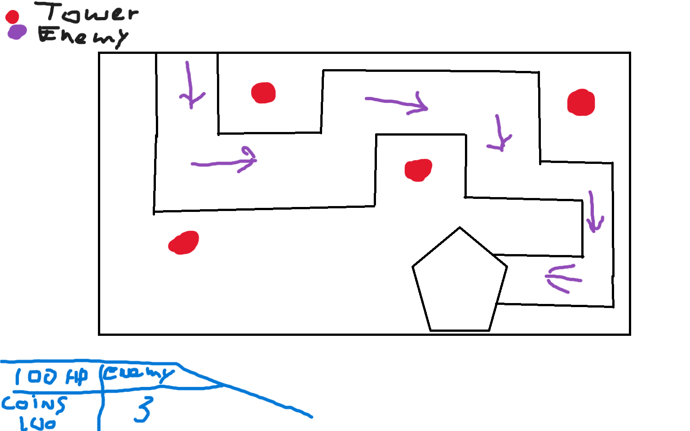

# Sprint 0 - Game Design Document : Tower Defense
Naam: Kevin Mei

Klas: SD2A

Datum: 08-09-2025

## 1. Titel en elevator pitch
Titel: TowerPower

Elevator pitch, Het spel is geweldig het geeft je nostalogie, als je wint krijg je een leuke verrassing die iedereen wilt natuurlijk en waarom zou je het niet willen spelen. 

## 2. Wat maakt jouw tower defense uniek
Bij mijn game heb je cool towers, enemys, map, en de UI. Ik heb al deze art zelf gemaakt!

## 3. Schets van je level en UI

Je schets bevat minimaal:
1. Het pad waar de vijanden over lopen met beginpunt en eindpunt.
2. De plaatsen waar torens gebouwd kunnen worden.
3. De locatie van de basis of goal die verdedigd moet worden.
4. De UI onderdelen geld, wave teller, levens, startknop en pauzeknop.
5. Een legenda met symbolen of kleuren voor torens, vijanden, pad, basis en UI.

## 4. Torens
Toren 1 ZwaardPatron, 10 Range, 20 Damage, ZwaardPatron heeft een zwaard en is sneller dan EdgePatron, kost 15 TowerPower coins.

Toren 2 WarriorPatron, 7.5 Range, 30 Damage, WarriorPatron heeft een Axe hij is sterker maar sloom. kost 30 TowerPower coins.

Toren 3 BoogPatron, 25 Range, 15 Damage, BoogPatron heeft een boog. kost 20 TowerPower coins.

Toren 4 WizardPatron, 17.5 Range, 20 Damage, WizardPatron Schiet blizem. kost 35 TowerPower coins.

Eventuele extra torens: Niks

## 5. Vijanden
Vijand 1 AlphaWolf, 15 Speed, 150 Health, Hij kan bijten, je krijgt 2.5 coins als je 1tje killed 

Vijand 2 AlphaSigma, 10 Speed, 200 Health, Hij kan soms torens hun ability ontwijken. je krijgt 3.5 coins als je 1tje killed 

Vijand 3 AlphaBoog, 12 Speed, 125 Health, Hij heeft een boog net als DihPatron maar als hij schiet dan staat hij stil. je krijgt 1.5 coins als je 1tje killed 

Eventuele extra vijanden: Niks

## 6. Gameplay loop
Beschrijf in drie tot vijf stappen wat de speler steeds doet.
1. plaats eerste een ZwaardPatron wat die is het goedkoopste

2. daarna als je je genoeg geld hebt koop andere towers

3. upgrade je towers als je genoeg geld hebt

4. wees op gepast want de enemys worden sterker bij elke wave

5. als je wave 5 heb voltooid heb je gewonnen

## 7. Progressie
Bij elke wave komt er 25 meer health bij elke Vijand.

## 8. Risico’s en oplossingen volgens PIO
- Probleem 1: Code UI werkt niet.
- Impact: Werkt me game wel?
- Oplossing: hulp vragen aan klasgenoten of online zoeken hoe ik het moet fixen.

- Probleem 2: Enemys lopen niet.
- Impact: Kan spel niet verder spelen.
- Oplossing: Script verbeteren of een nieuwe script bedenken.

- Probleem 3: Towers Spawnen niet.
- Impact: Hoe moet ik enemys killen?
- Oplossing: Script verbeteren of een nieuwe script bedenken.
  
## 9. Planning per sprint en mechanics
Schrijf per sprint welke mechanics jij oplevert in de build. Denk aan voorbeelden zoals vijandbeweging over een pad, torens plaatsen, doel kiezen en schieten, waves starten, UI voor geld en levens, upgrades, jouw unieke feature.

Sprint 1 mechanics: vijandbeweging over pad, waves starten

Sprint 2 mechanics: torens plaantsen, geld, upgrades

Sprint 3 mechanics: schieten en aanvallen UI, levens

## 10. Inspiratie
KingDom Rush, ik had het vroeger gespeeld, want toen ik dit speelde vond ik de art heel mooi en daarom heb ik dit soort art stijl toegevoegd aan mijn game, want dit geeft me nostalogie.

## 11. Technisch ontwerp mini

Lees dit korte voorbeeld en vul daarna jouw eigen keuzes in.

Voorbeeld ingevuld bij 11.1 Vijandbeweging over het pad
- Keuze:
Vijanden volgen punten A, B, C en daarna de goal.
- Risico:
Een vijand loopt een punt voorbij of blijft hangen.
- Oplossing:
Als de vijand dichtbij genoeg is kiest hij het volgende punt. Bij de goal gaat één leven omlaag en verdwijnt de vijand.
- Acceptatie:
Tien vijanden lopen van start naar de goal zonder vastlopers en verbruiken elk één leven.
Alle tien vijanden bereiken achtereenvolgens elk waypoint binnen één seconde na elkaar.

### 11.1 Vijandbeweging over het pad
- Keuze: Enemys spawnen er veel in.
- Risico: Ze passen niet op de pad.
- Oplossing: Enemys kleiner maken of het pad groter maken.
- Acceptatie: Enemys een voor een laten spawnen of naast elkaar lopen.

### 11.2 Doel kiezen en schieten
- Keuze: towers attacken en schieten
- Risico: werkt animatie?
- Oplossing: animatie testen en kijken of het weer werkt
- Acceptatie: Animatie wanneer je schiet of aanvalt damage krijgt.

### 11.3 Waves en spawnen
- Keuze: Enemys spawnen er veel in.
- Risico: Ze kunnen niet meer lopen omdat er te veel enemys spawnen.
- Oplossing: Code herschrijven en kijken of het weer werkt.
- Acceptatie: spawnrate verminderen en niet alles tegelijk spawnen.

  
### 11.4 Economie en levens
- Keuze: 100 hp kasteel het kasteel krijgt damage
- Risico: gaat de hp van 100 naar 0 in 1 keer als een enemy het kasteel aanraakt?
- Oplossing: testen en als dat wel zo is dat ik de code moet verbeteren
- Acceptatie: 15 damage als de enemy de kasteel heeft bereikt.

### 11.5 UI basis
- Keuze: UI is klikbaar
- Risico: kan ik er op klikken en dan laten spawnen
- Oplossing: Code herschrijven en kijken of het weer werkt.
- Acceptatie: In UI Towers kiezen met geld en daar op spawn plekken laten spawnen.
